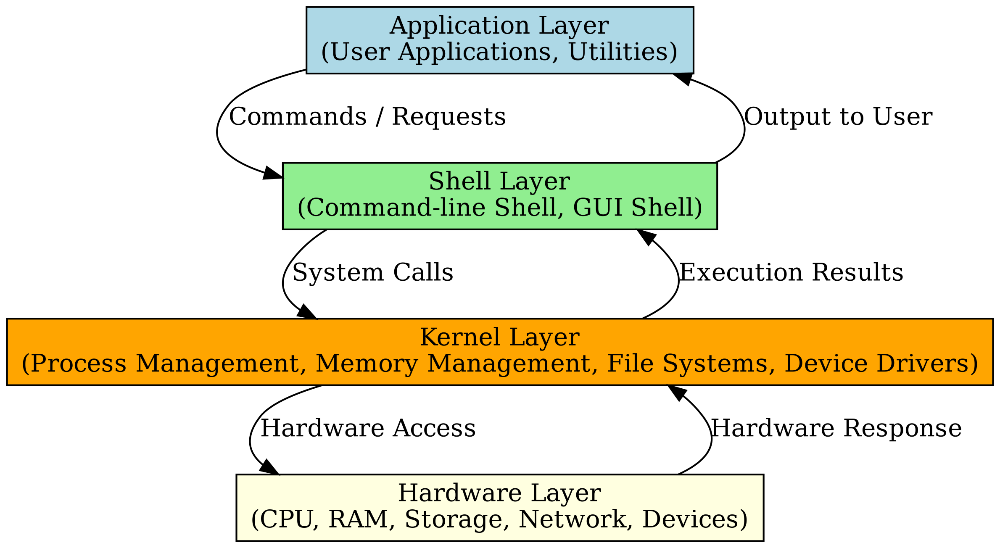
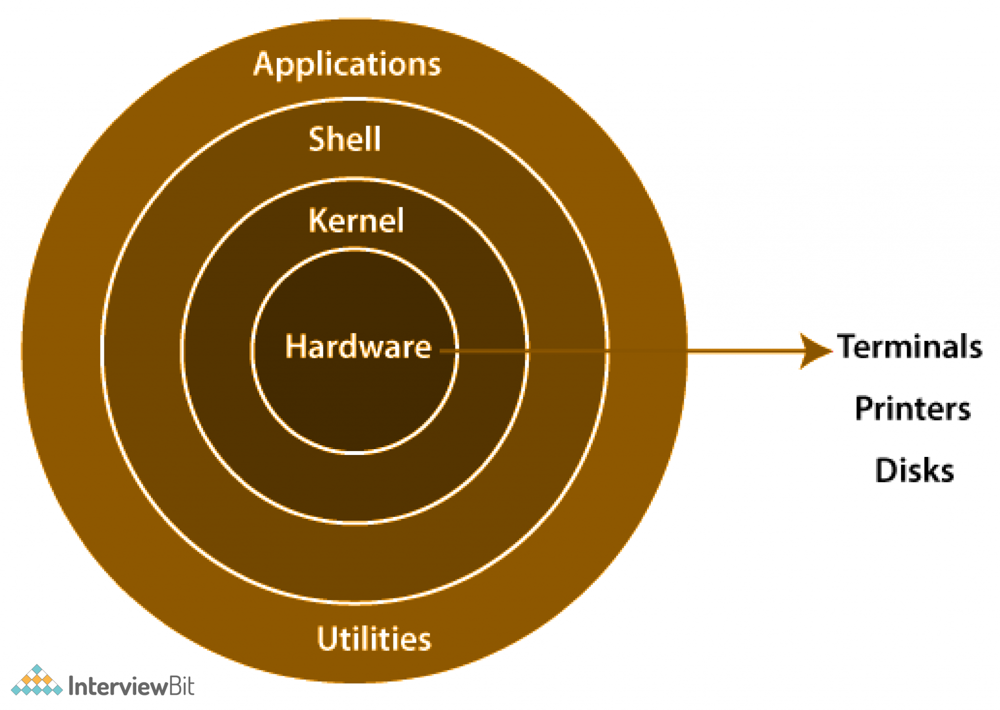

# Linux Architecture

## What is Linux?

Linux is an open-source Unix-like operating system kernel created by Linus Torvalds.

A Linux operating system consists of:

- Kernel
- Shell
- System Libraries
- Utilities/Tools
- User Applications

Linux is widely used in:

- Servers
- Cloud platforms
- DevOps infrastructure
- Containers
- Networking devices
- Embedded systems

---

# Why Linux Matters in DevOps

Linux is the foundation of most modern infrastructure.

Examples:

- AWS EC2
- Docker containers
- Kubernetes nodes
- CI/CD runners
- Nginx/Apache servers

A DevOps engineer must understand:

- Process management
- Networking
- Permissions
- Service management
- Logs and troubleshooting

---

# High-Level Linux Architecture



The Linux operating system follows a layered architecture model:

- Application Layer
- Shell Layer
- Kernel Layer
- Hardware Layer

## Each layer communicates with the layer below it through controlled interfaces and system calls.

# Linux Kernel

The kernel is the core component of Linux.

Responsibilities:

- Process management
- Memory management
- Device management
- File system management
- Networking
- Security and permissions

The kernel directly communicates with hardware.

Examples:

- CPU scheduling
- RAM allocation
- Disk access
- Network packet handling

Common kernel commands:

```bash
uname -r
uname -a
```

Example:

```bash
5.15.0-107-generic
```

---

# Shell

The shell acts as an interface between the user and the kernel.

Common shells:

- bash
- sh
- zsh
- fish

Responsibilities:

- Command execution
- Scripting
- Automation
- Environment management

Check current shell:

```bash
echo $SHELL
```

---

# User Space vs Kernel Space

## Kernel Space

- Direct hardware access
- High privilege
- Critical system operations

## User Space

- Applications run here
- Limited hardware access
- Safer isolation

Applications interact with hardware through system calls.

---

## Simplified Linux Layer View



## This simplified model shows how applications and utilities interact with the Linux kernel, which directly manages hardware resources.

# System Calls

System calls allow applications to communicate with the kernel.

Examples:

- open()
- read()
- write()
- fork()

Example flow:

```text
Application → System Call → Kernel → Hardware
```

---

# Linux Distributions

A Linux distribution includes:

- Linux kernel
- Package manager
- GNU tools
- Applications

Popular distributions:

| Distribution  | Usage            |
| ------------- | ---------------- |
| Ubuntu        | DevOps / Cloud   |
| Debian        | Stable servers   |
| CentOS Stream | Enterprise       |
| Rocky Linux   | RHEL alternative |
| Arch Linux    | Advanced users   |

---

# Boot Process Overview

`systemd` is the first userspace process started by the Linux kernel and is responsible for initializing system services.

Linux boot process stages:

1. BIOS/UEFI
2. Bootloader (GRUB)
3. Kernel Loading
4. init/systemd
5. Services Start
6. User Login

Important process:

```bash
PID 1 = systemd
```

Check:

```bash
ps -p 1
```

---

# Important Commands

```bash
uname -a
hostnamectl
lscpu
free -h
lsblk
uptime
whoami
id
```

---

# Real-World DevOps Relevance

Understanding Linux architecture helps in:

- Troubleshooting production systems
- Managing cloud servers
- Debugging containers
- Optimizing performance
- Automation scripting
- Monitoring infrastructure

Examples:

- High CPU debugging
- Memory leak investigation
- Service failures
- Kernel compatibility issues

---

# Common Mistakes

- Treating Linux as command memorization
- Ignoring system internals
- Running commands without understanding permissions
- Confusing shell with kernel
- Not understanding PID 1 and systemd

---

# Summary

Linux architecture is built around the kernel, shell, system libraries, and user applications.

A strong understanding of Linux internals is essential for:

- DevOps
- Cloud Engineering
- Site Reliability Engineering
- System Administration
